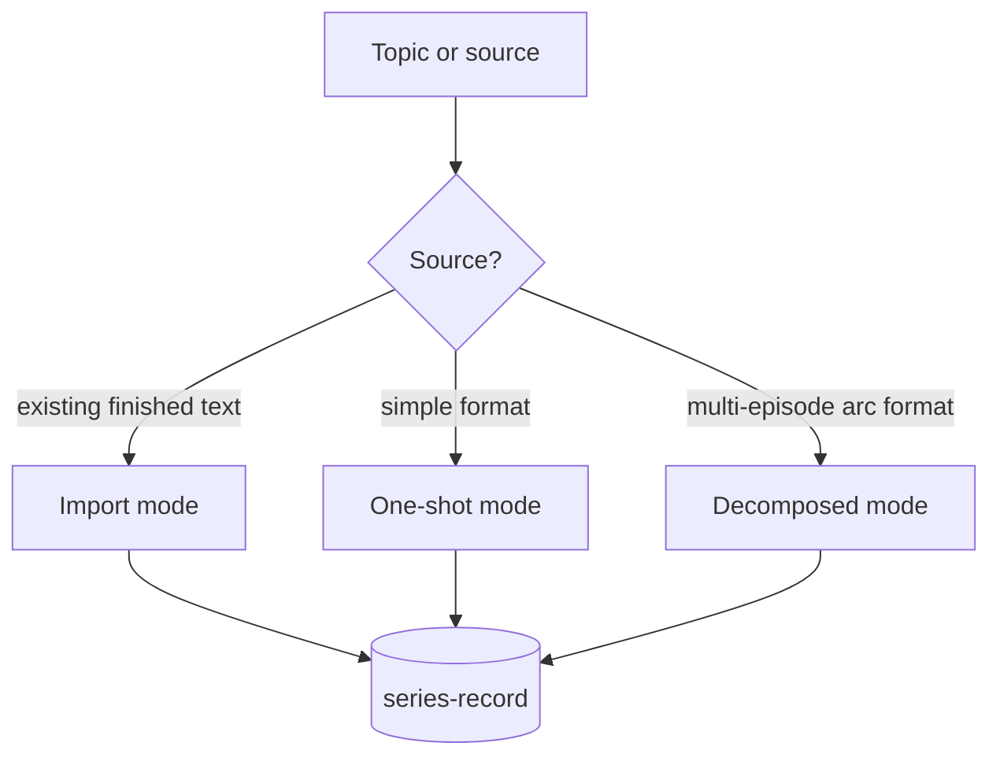
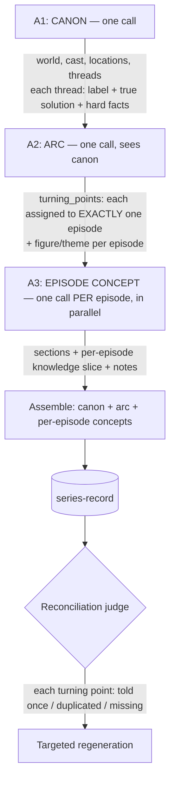
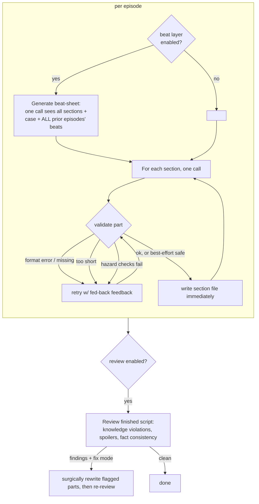
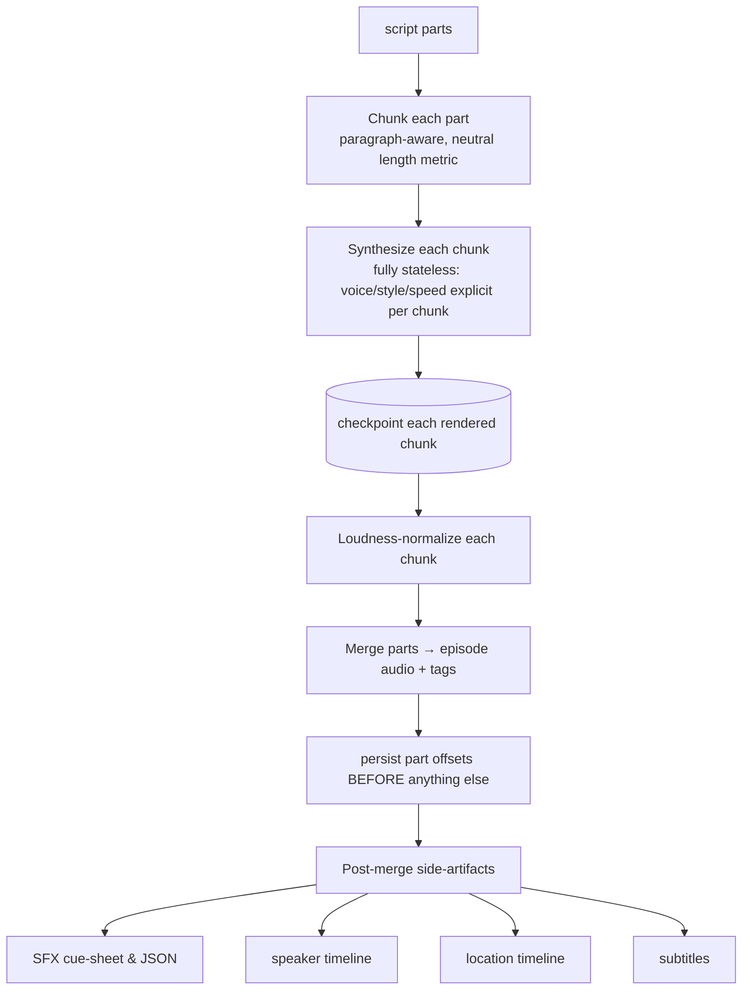
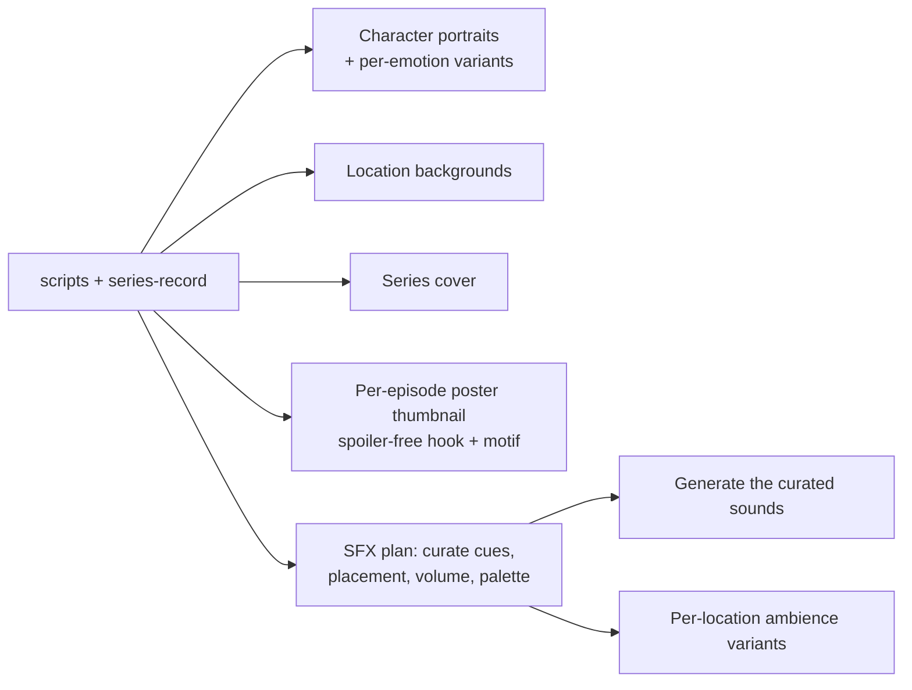

# Podcast Factory — Logical Blueprint (v1)

> A technology-neutral description of *what the system does and why*, meant as the
> starting point for a ground-up rebuild. It deliberately avoids naming languages,
> frameworks, or specific model/TTS vendors. Everything here is **workflow and
> logic**; every concrete tool is an interchangeable *role* (an LLM writer, a TTS
> engine, an image generator, a job runner). Where a rule exists, the *reason* is
> given — those reasons are the part worth preserving across a rewrite.

---

## 0. How to read this blueprint

Three things the rest of the document assumes. Without them, later sections read as
contradictory.

**Confidence tiers — logical coherence is not proof.** The sections carry very
different empirical weight, and must not be treated alike:

- **§1–8 — proven.** This is the *current, production-tested* system described as
  essence. High confidence; the rebuild should preserve its logic.
- **§9–11 — sound analysis, unbuilt.** Critiques and the robustness lens. The
  reasoning is validated; the recommendations are not yet implemented.
- **§11.2 and §12 — coherent hypotheses, unproven.** The depth architecture
  (projection + reflection, character spines/arcs). Logically consistent but
  *empirically untested* — a promising direction, not known-good. Prototype before
  trusting.

**Optimization objective — stated, so trade-offs are checkable.** This blueprint
optimizes, in order: **robustness → quality → cost.** Depth features (§12) and
independent-failure degeneracy (§11) deliberately *spend* cost and complexity to buy
quality and robustness. A change that saves cost at the expense of robustness is
*not* an improvement under this objective; if the objective should be different (e.g.
cost-first for a cheap high-volume format), the trade-offs below must be re-read.

> **The objective is not global — it is per format.** "robustness → quality → cost"
> is the default for the long, canon-heavy drama formats, where a wrong fact ruins a
> whole season and cost is amortized over many episodes. It is the *wrong* default for
> a cheap high-volume micro-format (*shorts*), where cost-first is correct and the
> full depth/degeneracy machinery is overkill. **§6 carries the explicit
> format → objective map** — read it before spending §11/§12 complexity on a format
> that does not want it. The borderline case is *soap opera* (ensemble, many
> episodes, paid assets per run): it inherits the drama default but is the one format
> where a cost-second reading is defensible, so its objective is called out
> explicitly there.

**"Optimized" means no compensation — not minimal structure.** §10–§11 *remove*
compensation layers (a second layer patching a bad first decision). §11–§12 *add*
load-bearing structure (a mechanism that structurally enforces a wanted property).
These are not in conflict: removing a patch and adding an invariant are the same
discipline — make the property structural instead of asserted. Do not read "§10
deleted machinery, §12 adds machinery" as incoherence; the test is always *which
kind* (§11's four categories), never *how much*.

---

## 1. What this is, in one breath

A **staged, resumable, self-healing content pipeline** that turns a one-line topic
into a finished, mastered audio-drama or narration **series** — script, voice,
sound, images, and distribution artifacts — with a language model doing all the
*authoring* and deterministic code doing all the *guaranteeing*.

The whole system is built on three load-bearing ideas:

1. **One document is the single source of truth** for a series. Everything —
   content, format, cast, voices, audio settings — lives in that one structured
   record. Every stage reads it; nothing keeps hidden state elsewhere.
2. **Each stage is a pure function from files to files.** Given the same inputs it
   produces the same outputs, writes them incrementally, and can be re-run at any
   time to resume exactly where it stopped. No stage holds state in memory across
   runs.
3. **Creativity is delegated; correctness is enforced.** The LLM is asked to
   *write*; deterministic validators decide whether the result is acceptable, and
   feed failures back as retry instructions. When creativity plateaus, a
   *best-effort fallback* keeps the pipeline moving instead of dead-locking.

---

## 2. Core design principles (the invariants to keep)

These are the properties that make the pipeline survivable in production. A rewrite
may change every tool and still be "the same system" if it keeps these.

| Principle | What it means | Why it exists |
|---|---|---|
| **Cast once, chain by seams** | Generate each unit exactly once; once *accepted* it is frozen — never rewritten. Each unit is cast against an explicit **seam contract** (what it receives from its left neighbor, what it must hand to its right), and the arc defines those seams *upfront* so units cast independently and fit by construction. | Post-hoc mutation (repair loops, reconciliation-rewrite) is where drift and instability enter. Getting it right once and freezing beats generate-then-patch. See note below. |
| **Single source of truth** | One structured series-record drives the entire pipeline. No parallel config. | Prevents drift between "what the series is" and "what got produced." |
| **Pipeline = folder = stage** | The series lives as a workspace whose directory layout *is* the pipeline: one folder per stage, each with an input contract and an `output/`. | Stage boundaries are physical and inspectable; a human can see exactly how far a series got. |
| **Resumability by artifact existence** | A stage skips any unit whose output file already exists. Partial work is written immediately, unit by unit. | A crash, kill, or timeout never loses completed work; a re-run costs only the missing units. |
| **Idempotency** | Re-running a completed stage is a no-op (or cheap re-derivation), never a corruption. | Safe to click "run everything" repeatedly; safe to automate. |
| **Retry with fed-back feedback** | On a validation failure, the exact failure text is appended to the next attempt's prompt. Escalate wording on the final attempt. | Turns a blind retry into a corrective one; the model learns *this* mistake. |
| **Best-effort fallback** | Distinguish *fatal* failures (output would crash a downstream parser) from *soft* failures (merely below a quality target). Never dead-lock on a soft failure — accept the least-bad safe attempt. | Some scenes genuinely can't hit a word target; oscillating retries waste money and still fail. |
| **Self-healing batches** | A batch runs extra rounds over only the still-failing units before giving up, and records permanent failures as an explicit marker file. | A transient hiccup shouldn't strand a unit "silently unfinished." |
| **Validation as a gate, not a report** | Structural validity is a hard error *before* work starts; suspicious-but-legal things are warnings. Unknown fields are warnings (typo detection for machine-written data). | Catches malformed machine output early instead of mid-render. |
| **"Don't know" ≠ "clean"** | A review that failed to run returns *unknown* and writes **no** cache file; a review that ran and found nothing writes an empty result. | Prevents a failed check from being cached as "passed" and never retried. |
| **Environment split by coupling** | The lightweight authoring path (LLM-only, no heavy runtime) must never depend on the heavyweight media path (audio libraries, GPUs). | Keeps script generation runnable anywhere, cheaply, without the media toolchain. |
| **Single-source substitution** | Facts that appear in prompts (voice roster, model names, limits) are injected from code at build time, never hand-copied into prompt templates. | One place to change a fact; templates can't drift from reality. |

**Note — "cast once, chain by seams" is the meta-principle behind several of the
others.** It subsumes resumability (write once, never rewrite), immutability, and
composability, and it is the *reason* the rebuild removes the post-hoc repair loops
(§10.1, §10.2): those are generate-then-patch, the opposite of cast-once. Two
clarifications keep it honest:

- **Retry before acceptance is part of the casting, not a violation.** The
  `validate → retry → feedback` loop shapes a unit *while it is still in the mold*;
  "cast once" means *once accepted*, frozen. The retry loop survives (§10.8 carve-out).
- **A thin final pass survives for exactly two things no upfront seam can plan for:**
  emergent drift *during* casting (prose quietly departs from the plan) and *global*
  properties only visible once every unit exists (e.g. no phrase repeated across the
  whole season). This is the §10.1 "lean two" — not a repair loop, a net for the
  non-plannable. Pure cast-once with zero final pass throws that net away.

The cost of this principle is a *relocation*, not an addition: all the weight moves
onto the arc (the mold) and the seam contracts being correct — one place to be right
instead of many places to patch. The audio merge is the existing proof it works:
each part is cast self-contained, `part_offsets` are its seam, and chaining is
trivial stream-copy. The rebuild generalizes that seam discipline to sections and
episodes.

---

## 3. The domain model

### 3.1 The Series record (the single source of truth)

A **Series** is one structured document. Conceptually it has three layers:

```
Series
├─ Identity & format      title, language, mode, format/template, narration style
├─ Production settings     cast→voice mapping, audio/render settings, output naming
├─ Canon (season-wide)     the world, cast, locations, and story "threads":
│                          each thread's label + its true resolution + its hard facts
└─ Episodes[]             per episode: figure/theme, author notes (intro/outro),
                           sections[], and a per-episode "case" slice
```

Two structural rules carry most of the weight:

- **Season canon is written once and frozen.** The *facts* of a storyline (who did
  it, what the evidence is) live in exactly one place — the season canon. Episodes
  reference a thread by label and only ever add *whose knowledge grows*. This is
  what prevents fact-drift across episodes.
- **A "section" is the unit of both planning and writing.** Each section is a
  one-line intent (`title` + *what happens* + *who* + which thread + location +
  word budget). The section list is the bridge between the abstract plan and the
  concrete prose.

### 3.2 The workspace = the pipeline

Each series is a self-contained workspace whose folder layout mirrors the stages:

```
series/<slug>/
  identity + stage-routing notes         (what this series is; where each stage lives)
  references/                            per-series editable copies of the prompt
                                         contracts (the master templates stay untouched)
  stages/
    01_concept/  → output/series-record   (the single source of truth)
    02_scripts/  → output/ scripts, reviews, beat-sheets, phrase report
    03_audio/    → output/ mastered audio, timelines, cue-sheets, subtitles, index
    04_visuals/  → output/ character/location/cover images + prompts
  assets/                                optional intro/outro/transition stings
```

A pointer file marks the "current" series so every tool has a default when none is
specified. Creating a new series **atomically reserves** its slug (the empty folder
*is* the reservation) so parallel creators can't collide on the same name.

---

## 4. The workflow

The pipeline is five stages. Each is a pure transform `files → files`, guarded by
validation, resumable by artifact existence.


---

### Stage A — Conceive the series

**Goal:** produce the single source-of-truth record from a topic.

There are three entry modes:



**Import mode** — for pre-existing text the model must not invent (e.g. adapting an
existing story). Split the source into episodes/parts deterministically; the model
only writes metadata (title/theme), never plot. Marked as *imported* so the
script-writing stage skips generation entirely.

**One-shot mode** — for simple formats (single narrator, fixed structure). One
generation call produces the whole record. Invalid JSON, schema errors, *and* wrong
episode count are all retryable and fed back. If every attempt is schema-clean but
the count is off, accept the closest one (best-effort) rather than abort.

**Decomposed mode** — for multi-episode arc formats, and the most important idea in
the whole system. Instead of writing all episodes in one (or a few batched) calls,
generate in three tiers:



Why decompose:

- **The root cause it fixes:** when episodes are written in independent batches,
  *event allocation* becomes a property of the batch boundary, not a deliberate
  choice. Two batches that never see each other can both stage the same climax, or
  neither can. Fixing the *facts* (canon) does **not** fix this — canon pins who-did-
  it, not *which episode tells what*.
- **The mechanism:** the ARC tier assigns every turning point to exactly one
  episode *before any episode is written* — like a writers'-room breakdown. A
  double-climax becomes structurally impossible.
- **Parallel-safe:** each episode-concept call sees canon + arc + its own assigned
  turning points + a short summary of neighbors, but **never** the parallel output
  of sibling episodes. There's no batch boundary where granularity can flip.
- **Detail-depth as a per-section gate:** each section's "what" must fall inside a
  neutral length band, and the spread within an episode is bounded — so one episode
  can't mix three lavish scenes with one stub scene. This is validated *before*
  acceptance, with feedback, not audited afterward.
- **Reconciliation pass:** after all episodes exist, a judge reads the arc's
  turning points against the finished sections and flags each as *ok / duplicated /
  missing*. To defeat judge noise, run it several times and count a finding only if
  a supermajority of runs agree. Findings route into the same targeted-repair
  dispatcher as content review.

**Repair dispatcher (shared by all review findings).** Findings are *split by
scope* and each group fixed with the smallest possible call:

1. Findings **with** an episode number → resend only those episodes (plus a compact
   index of the rest as context).
2. Findings **without** an episode number (e.g. casting rules over the cast list) →
   resend only the top-level fields, not the (large) episode array.
3. Only what 1–2 couldn't fix → a full-document rebuild, as a pure safety net.

> **Why split by scope (a real, expensive bug):** a naïve dispatcher decides at the
> *weakest* finding — one scope-less finding tips *all* findings into the full
> rebuild, which reliably truncates on large series. Splitting keeps each repair
> small and within output limits. Every repair path also detects truncated output
> and bails rather than blindly retrying a length problem. Partial success is kept,
> never discarded.

**Checkpointing.** Canon, arc, and each episode concept are independent cached
units keyed by the *call parameters* (not the substituted prompt). A final unit's
permanent failure leaves the others intact; an identical re-run regenerates only
what's missing. The checkpoint is cleared only *after* the series is successfully
written — because review/repair happen in between and are themselves long calls.

---

### Stage B — Write the scripts

**Goal:** turn each episode's section list into finished, TTS-ready script text.



Key logic:

- **Generation is section-by-section and resumable.** Each finished section is
  written immediately with part markers, so a re-run skips already-written parts.
- **Continuity is a known gap, handled deliberately.** The context handed to the
  model is only the *previous* section, not the whole episode/series — to keep
  prompts small. Cross-episode continuity therefore flows through the *notes*,
  *theme*, and *case slice* fields, and is closed by two optional mechanisms:
  - **Beat layer (before the prose):** one cheap call plans 3–6 beats per scene,
    seeing *all* prior episodes' beats (season memory — with only the immediate
    predecessor, finales "forget" earlier episodes). Scene 1 must include an
    explicit time-jump beat to prevent timeline drift. The dialogue writer then
    plans over the whole episode instead of just the last section. A failed beat
    call is non-fatal — the writer falls back to previous-section context.
  - **Post-hoc review (after the prose):** a second pass on the finished text
    checks knowledge violations, premature spoilers, and fact consistency. In
    *fix* mode, each flagged part is rewritten in isolation and spliced back, then
    the whole episode is re-reviewed to confirm the fix landed.
- **Word budget per part, with tolerance.** A neutral length metric (so it works
  across writing systems) with a tolerance band — a fixed buffer used to sit inside
  the model's normal counting noise and triggered retries on nothing. **Overlength
  is never a retry** (accept with a warning): a long part costs seconds, a
  regeneration costs a full prompt. Only *too short* and *format errors* retry.
- **Best-effort fallback.** Validation returns *(ok, fatal?, badness)*. Fatal =
  missing parts or a format error that would crash the downstream parser — never
  acceptable. Otherwise, if all retries fail only on word budget, take the least-bad
  safe attempt rather than abort. A safe attempt already inside a small multiple of
  tolerance is accepted immediately (further retries wouldn't beat it).
- **Deterministic hazard checks** catch classes of failure that no prompt rule
  reliably prevents: narrator lines that audibly "leak" internal labels/scene
  numbers (spoilers), pure model noise (letterless "speech", placeholders, leftover
  markup, foreign-script characters mid-sentence). These are retryable, fallback-
  safe, and raise the badness score.
- **Phrase guard (deterministic, cross-episode).** Count repeated n-grams and style
  words across already-written episodes and feed the worst offenders back as an
  "avoid" block (proper names exempted — characters/places *must* recur). Also emit
  a human-readable phrase report as a review gate.

**Light vs. heavy model.** Non-creative calls (metadata, the two review passes,
import summaries) use a cheap model; creative work (sections, beats, repairs) uses
the strong one. The reviewer must be strong enough to see real errors — a cheap
reviewer returned empty reviews despite real defects.

---

### Stage C — Voice the scripts

**Goal:** turn each script into a mastered audio file plus the side-artifacts a
video editor needs.



Key logic:

- **Stateless synthesis.** Every TTS call carries its voice, style, and speed
  explicitly per chunk — generation order can never affect audio quality. Chunks are
  checkpointed as they render (resumable exactly like script generation).
- **Loudness discipline.** Normalize each chunk before merge (level jumps between
  chunks of the same voice are otherwise audible), then master to a target loudness.
- **The point-of-no-return invariant (the most important safety rule here).** The
  merge deletes the per-part audio and **persists the part offsets *before* it
  returns**. The five post-merge steps (cue-sheets, timelines, subtitles) then read
  only small per-part side-files, each wrapped so a failure warns and continues.
  Post-processing also runs when the episode audio *already* exists, using the
  persisted offsets. Reason: those steps used to run unguarded *after* the point of
  no return — a crash there left the audio "done" and the source deleted, and the
  only resume check skipped the episode forever with missing metadata.
- **Voice consistency guards.** (1) Two roles resolving to the same voice is a hard
  error. (2) Audio is cached by *filename*, not by voice config — so editing a
  role's voice later would silently produce a mixed-voice series. A manifest of the
  committed voice/speed/seed per role is compared on every run and hard-stops before
  any file access if it changed. (3) The manifest baseline is written only *after*
  the backend is reachable and every voice name resolved — never on first touch, or
  a run that failed seconds later would leave a broken config cached as "already
  rendered."
- **Sound effects are never mixed into the audio** — only logged with timestamps
  (human-readable + machine-readable) for a downstream video mixer. *This is exactly
  why the drama formats require spoken narrator orientation lines:* with no visual
  track and no mixed SFX, a scene change would otherwise have zero audible signal.
- **Timelines as pure derivations.** Speaker presence, location spans, and scene
  membership are derived from the part offsets — no extra generation. A mood change
  breaks a location span even at the same location, so the video mixer has a
  boundary to cross-fade on.
- **Self-healing + parallelism.** A batch runs extra rounds over only the failing
  episodes; permanent failures are recorded as a marker the control surface can show
  as a red card. An optional second render backend lets two episodes render in
  parallel behind one queue, with stable merge order.
- **Optional cloud batching.** When a batched render backend is available, chunks
  are pooled across part boundaries, bucketed by voice kind, and sent in windows for
  real parallelism — with identical per-chunk checkpoint semantics and the same
  post-processing (suspicious segments are re-rendered individually rather than
  trusted).

---

### Stage D — Visual & sound assets

**Goal:** the images and curated sounds a video render needs. All of these are
"nice-to-have": a failure never fails the episode.



Key logic:

- **Prompt/text stage separate from render stage.** The model writes image prompts;
  the actual image call is separate and skips per-file what already exists. A prompt
  file existing must *not* block the render — otherwise a later-added image key never
  reaches generation.
- **Emotion variants, cost-capped.** Portraits get a variant per emotion actually
  used in the scripts, capped to the most frequent few per role (a love-subplot role
  keeps "love"; others don't). Missing emotions fall back to the neutral portrait.
- **Cross-series asset reuse, human-gated.** Portraits/locations/SFX can be reused
  across series by exact-hash match, then fuzzy match. But fuzzy matching on long,
  plot-rich descriptions is unreliable (real duplicates and false positives share
  the same score band) — so instead of auto-guessing, a *near-miss audit* lists
  candidates below the confident threshold and a human decides.
- **The SFX plan is the missing link** between "the model wrote a cue in the script"
  and "a mixer places a sound at millisecond X." It runs one call per episode with a
  *growing palette* (episode N sees assets from 1..N-1 and is bound to reuse them —
  so the door-slam in episode 7 sounds like the one in episode 1). It decides, per
  cue: keep/drop (non-sounds like "a beat, tension held" are dropped), which palette
  asset, placement (its own silence gap *before* the next line, or *under* it), and
  volume. It's optional and hand-editable; without it the chain falls back to the
  old cue-on-line-start behavior. The plan addresses cues by *position*, so a stale
  plan is cross-checked against cue text and ignored on mismatch — a stale plan can
  never place the *wrong* sound, only none.
- **Ambience is per-mood, not per-location.** Each location gets up to a few mood
  variants and each scene is assigned one; loops contain no single events (a
  door-slam in a 20-second loop would slam every 20 seconds).
- **Paid asset generation never runs automatically.** Steps that cost money per run
  are always manual; finished assets are skipped, so re-clicking is free.

---

### Stage E — Package & distribute

**Goal:** the artifacts a human uploads or hands to a video editor.

- **Anthology merge** (optional, per series): stream-copy the episodes into one file
  with chapters — never re-encoded or fully loaded into memory. Formats where
  episodes ship individually skip the merge but still get per-episode index files.
- **Upload index**: a human-readable file per series/episode with title,
  description, a *spoiler-free* audience question (bound to the dilemma, never the
  twist), and chapter list — ready to paste into a video description.
- **Teaser highlights**: the model picks 1–3 short highlight ranges per *voiced*
  episode by referencing subtitle-cue *indices* (never raw timestamps — the code
  computes milliseconds from cue boundaries, so it can't hallucinate a time and
  snaps to sentence boundaries). The actual clipping happens outside, in a video
  editor.

---

## 5. Cross-cutting mechanics

These recur in every stage and are the real "engine."

**Incremental write + existence-based resume.** Always write the smallest completed
unit immediately; always resume by checking which units already exist. This single
pattern gives crash-safety, cheap re-runs, and idempotency for free.

**Retry loop with fed-back feedback and escalation.** The universal shape:

```
attempt := 1
loop:
    result := generate(prompt + accumulated_feedback)
    (ok, fatal, badness, detail) := validate(result)
    if ok: return result
    if attempt == last and not fatal:
        return least_bad_safe_attempt_so_far      # best-effort fallback
    accumulated_feedback += detail                 # feed the exact failure back
    if attempt >= escalation_threshold:
        accumulated_feedback += stronger_wording   # "still wrong — add a concrete beat"
    attempt += 1
```

**Fatal vs. soft failure.** *Fatal* = the output would crash a downstream parser (a
format error, a missing unit). Fatal is never accepted. Everything else is soft and
subject to best-effort fallback. This one distinction is what lets the pipeline
never dead-lock while never shipping corrupt data.

**Transient vs. terminal errors.** A single flaky generation call that feeds a retry
loop must be *retryable*, never fatal to the batch. Only genuinely unrecoverable
conditions (tool missing, not authenticated) abort immediately.

**"Don't know" vs. "clean."** A check that couldn't run returns *unknown* and writes
no cache file; a check that ran and passed writes an empty result. Caching an
"unknown" as "clean" is the classic bug that makes a broken check invisible forever.

**Validation policy.** Structurally invalid → hard error before work starts. Legal
but suspicious → warning. Unknown field → warning (typo detection for machine-
generated data). One validator is reused everywhere (e.g. concept generation
validates by building a candidate document and running the *same* series validator),
so validation logic lives in exactly one place.

**Long-call observability.** Any long generation call emits a heartbeat so a running
call is distinguishable from a hang. JSON parsing is tolerant: strip fences, then
try every `{` position and take the *longest* successful parse (models sometimes
emit a short illustrative fragment before the real object).

**System-wide concurrency brake.** A cross-process semaphore caps how many
generation subprocesses run at once across *all* control surfaces — a pure
safety-valve against a runaway, set high enough not to throttle legitimate parallel
work. (It was investigated as the cause of a production incident and *cleared* — the
real culprit was truncated output from over-large batches, which is why batch size,
not concurrency, is the thing to keep small.)

**Single-source substitution.** Facts that must appear inside prompts (voice roster,
model names, numeric limits) are injected from code at build time via placeholders.
Never hand-maintained in prompt templates — a template can't drift from reality, and
a fact changes in exactly one place. Unreplaced placeholders warn loudly.

---

## 6. The format catalog (the product definitions)

The system supports several *formats*, grouped into two *modes*. The format is a
data choice in the series-record, plus a set of prompt contracts — **no code change
per format** is the design goal. The genius move here: a format can *repurpose* an
existing schema block (e.g. an essay format reusing the "case" block to carry
thesis + evidence) and inherit review/beat features for free, because those gate on
*data presence*, not on format name.

| Mode | Format | Essence |
|---|---|---|
| **Narration** (one voice, style per section) | *narration* | Classic anthology / true-crime; section count scales with target length. |
| | *media analysis* | Fixed four-part deconstruction lens; length scales word budget, not structure. Repurposes the case block as thesis+evidence. |
| **Drama** (multi-voice, per-line speaker/style/speed tags; SFX cues logged not mixed) | *language course* | Learn-a-language radio play; vocabulary notes stripped before TTS and re-fed to the next section. |
| | *crime drama* | One continuous case per season; per-role knowledge slice makes lies/contradictions emerge organically from the knowledge gap. |
| | *soap opera* | Ensemble with several parallel threads; section count chosen per episode by how many threads need airtime; reusable locations. |
| | *shorts* | Hook-first vertical-video micro-format: hook → turn → sting, tiny cast, captions burned per sentence, hard sting cut. |

**Format → optimization objective (the §0 map, made explicit).** The default
"robustness → quality → cost" is *not* universal; each format buys a different thing,
so the §11/§12 complexity is worth spending only where the objective wants it.

| Format | Objective (ordered) | Which machinery is worth its cost |
|---|---|---|
| *narration* | robustness → quality → cost | Full validation + best-effort fallback. No canon/arc tiers (single-thread), no §12 depth. |
| *media analysis* | quality → robustness → cost | Fixed 4-part lens; the thesis+evidence reuse of the case block; no depth arc. |
| *language course* | robustness → cost → quality | Correctness of the vocabulary/notes contract dominates; prose depth is secondary. Skip §12. |
| *crime drama* | **robustness → quality → cost** (the default) | The full stack: canon→arc→episode tiers, turning-point allocation, and §12 depth *if the §12 test passes*. This is the format the default was written for. |
| *soap opera* | robustness → quality → **cost** ⚠️ | Inherits the drama stack, **but** the borderline case: ensemble + paid assets per run make cost a real second concern. Run the full tiers; be conservative with §12 arc-doubling and paid Stage-D steps until they prove out per season. |
| *shorts* | **cost → quality → robustness** | Cost-first. The micro-format does *not* want canon/arc tiers, the beat layer, or §12 depth — a hook→turn→sting is too small to amortize them. Keep only the retry/fallback core. |

Read this before applying §11's degeneracy spends or §12's depth to a format:
spending drama-tier machinery on *shorts* is a category error, not thoroughness.

**Format rules worth preserving (each learned the hard way):**

- **Accent casting rule.** Only some voices are accent-free; any accent must be
  diegetic (the character's biography explains it) or made unremarkable by setting.
- **Narrator is not a character.** In drama it's a fixed role that speaks 1–2
  orientation lines per part (who/where/when) and never gets a knowledge slice. It
  must never speak internal labels or scene numbers (spoiler leaks), and its
  style/emotion is always forced to a fixed neutral value — emotion on the narrator
  voice sounds audibly "off," and "no style" is *not* neutral (it falls back to
  whatever the backend defaults to).
- **A short beat means genuinely fewer words,** not a cosmetic discount off the
  episode default — a 10–20% trim reliably makes the writer undershoot.
- **Later episodes open with a scripted "previously on" recap** (in the long
  formats), gated by format.

---

## 7. The data contract (conceptually)

The series-record's shape, described as intent rather than syntax:

```
Series
  identity        : title, language, mode, format, narration-style, style guidelines
  cast→voice      : role → { voice, default style, speed, optional seed }
                    (two roles may never map to the same voice)
  locations       : key → description        (only formats that use backgrounds)
  format/length   : words-per-part band, parts-per-section, per-section overrides
  generation      : which model is "strong" vs "cheap", feature toggles (beats, review)
  audio/render    : backend choice, loudness targets, merge policy, concurrency
  output naming   : filename prefix, etc.
  threads         : label → { true resolution, hard objective facts }   ← canon, frozen
  episodes[]      :
    figure/theme  : the episode's protagonist + throughline
    intro/outro   : author notes (continuity carriers, not spoken verbatim)
    sections[]    : { title, what-happens, who, thread, location, word budget }
    case          : per-episode knowledge slice:
                    { thread-label → free-text "what this role knows/hides/misbelieves" }
                    (single object for a one-case format; a list for multi-thread formats)
```

Two schema lessons:

- **Prefer flatter free-text over deep nesting.** A per-role knowledge slice as 1–3
  sentences of prose beats three separate nested lists — nesting depth, not text
  volume, is what makes machine-generated JSON truncate/break.
- **Freeze the drift-prone facts, free the rest.** The season canon's
  resolution/facts stay strictly structured and written once; the per-episode
  additions can be loose prose. Strictness is spent only where drift actually hurts.

### 7.1 Schema versioning & migration (the "single source of truth" has a lifetime)

"One document is the truth" (§1) is only safe if the document's *shape* can change
without stranding the seasons already written against the old shape. This is not
hypothetical: the schema evolved during the very rebuild this blueprint describes, and
a real library of in-flight series existed while it changed. The rebuild must design
for it from the start, not bolt it on.

- **Every series-record carries a `schema_version`.** A stage that reads a record it
  does not recognize must *refuse loudly*, never guess. An absent version means
  "pre-versioning" — the oldest migration step, not "current" (this is the §8
  missing-⇒-default rule, but the default here is *oldest*, because a new field
  read as its zero-value on an old record is exactly the silent-drift trap).
- **Migrations are pure, forward-only, and idempotent** — the same `files → files`
  discipline as a stage. `migrate_vN_to_vN+1(record) → record`, chained; re-running a
  completed migration is a no-op. A migration never regenerates content (that would
  violate cast-once); it only *reshapes* existing structure and fills new fields with
  an explicit, inspectable default or a `needs-backfill` marker.
- **New required fields degrade, they don't crash.** When a rebuild adds a field the
  old record can't supply (e.g. §12's character spine, or a §13 seam block), the
  migration writes a `degraded/unknown` state (§10.3), not a fabricated value. The
  stage then treats that unit as resumable-incomplete — the old season keeps playing;
  the new capability is simply absent until deliberately backfilled.
- **Frozen canon is migrated, never re-derived.** The drift-prone facts are frozen by
  design (§3.1); a migration that re-invented them would reintroduce fact-drift across
  a version boundary. Migration may add *structure around* the frozen facts, never
  rewrite the facts themselves.
- **The workspace records its version too.** Because the folder layout *is* the
  pipeline (§2), a layout change (a renamed stage folder, a new `output/` contract) is
  a migration in the same sense. The per-series routing notes (§3.2) name the layout
  version so a control surface can detect and offer to migrate an old workspace
  instead of silently half-reading it.

---

## 8. Orchestration & execution model

The pipeline stages are driven by a thin control layer with these properties (the
current implementation is a local web cockpit + CLIs + optional cloud GPU, but the
*logic* is what matters):

- **Every stage is independently runnable** and named; a stage takes "which series"
  and resumes from its outputs. A pointer file supplies the default series.
- **Jobs are parallel per series, except on a shared exclusive resource.** Anything
  that's pure authoring (LLM-only) can run for two series at once. Anything that
  shares one physical device (a single local TTS process) takes one global lock so
  two such jobs can't yank the device out from under each other.
- **The control surface polls filesystem state** to show, per episode, exactly
  what's done and what's missing — the folder-as-pipeline model makes this a pure
  read.
- **Isolation for parallel cockpits.** Multiple control instances decouple their
  "active series" from the global pointer so they don't rewrite each other's state,
  especially during creation. A create step announces its new slug on its own output
  stream so the right instance adopts it.
- **A boolean-flag lesson worth carrying:** a *missing* field is not the same as an
  *unchecked* box. Defaulting a missing flag to "off" can silently invert a CLI
  default and, combined with a stale cached UI, disable a fix step that looks
  enabled. Missing key ⇒ use the default, always.

---

## 9. Redesign guidance — what to keep vs. what is incidental

**Keep (this is the system's actual identity):**

- The single-source-of-truth record and the workspace-as-pipeline layout.
- The five-stage decomposition and the *canon → arc → per-episode* generation tiers
  with turning-point allocation. This is the core insight; most quality problems
  trace back to violating it (event allocation leaking to a batch boundary).
- Every cross-cutting mechanic in §5 — they are the difference between a demo and a
  production pipeline.
- The "creativity delegated, correctness enforced" split, with fatal-vs-soft failure
  and best-effort fallback.
- The format-as-data goal: new formats should be prompt contracts + schema reuse,
  not new code paths.

**Incidental (swap freely):**

- Which LLM, TTS engine, and image generator are used.
- The specific runtime split (no-heavy-runtime authoring path vs. media path) — keep
  the *decoupling principle*, but the exact packaging is a tooling choice.
- The control surface being a local web app; it could be anything that runs named,
  resumable stages and shows filesystem-derived status.
- The concurrency numbers, timeouts, and word bands — all tunable constants.
- The specific side-artifact formats for the downstream video mixer — that's a
  contract between two systems, redefinable if you rebuild both.

**Known traps to design out from the start** (each cost a production incident):

1. A failed check cached as "passed." → Enforce *unknown ≠ clean* at the type level.
2. Post-merge steps after the point of no return. → Persist recovery state *before*
   the irreversible delete; make every post step independently retryable.
3. Repairing at the weakest finding's scope. → Split findings by scope; keep each
   repair small and truncation-aware.
4. Event allocation leaking to batch boundaries. → Allocate turning points centrally
   before writing episodes.
5. Audio cached by filename while voice config changed underneath. → Compare a
   committed config manifest and hard-stop on drift.
6. Missing-flag treated as unchecked. → Missing ⇒ default.
7. Over-large single generation calls truncating. → Prefer many small calls with a
   growing shared context over one big call.

---

## 10. Redundancies the rebuild should dissolve

The current logic is mature, but it carries **accumulated compensation machinery**:
in several places an early optimization is patched by a *second layer* instead of
being revised. A rebuild is the moment to make the *first* decisions differently so
the second layers never need to exist. Ordered by leverage.

> **Read this section together with its verdict line.** Each item below carries a
> **Verdict** stamped by the §11 degeneracy lens — that verdict is *authoritative*,
> the surrounding prose is the reasoning that produced it. Where a Verdict amends the
> "Move" (10.1, 10.6, 10.8), the Verdict wins. §11 is no longer a second table to
> reconcile against; it is the boxed cut-rule plus the record of what the lens
> changed.

### 10.1 One continuity strategy, not three *(highest leverage)*

The decision "context to the writer is only the *previous* section" is a cost
optimization. It *creates* the continuity gap — which is then patched by three
compensations: author notes, a beat layer (before the prose), and a review pass
(after). The beat layer and the review solve the **same** gap from opposite ends,
and when beats are on the writer already sees the whole-episode overview — so the
"previous section only" constraint is *already* lifted, just inconsistently.

**Move:** a single continuity strategy. Let the section call see the full episode
plan plus a running summary of prior episodes. That collapses the beat layer and
most of the post-review into one layer. Keep a lean post-check only for what
planning structurally can't catch (prose-level spoilers, fact consistency).

This is the **cast once, chain by seams** principle (§2) in action: the plan +
running summary *is* the seam contract each section is cast against, and the heavy
post-review is generate-then-patch — exactly what cast-once removes. The lean
post-check is the §2 "thin final pass" for the non-plannable, not a repair loop.

> **Verdict (compensation + degeneracy):** amended — collapse 3 → **2**, not 3 → 1.
> Plan-before and check-after fail *independently* (real degeneracy — keep both). Only
> the triple execution and its self-inflicted cause (small context) are compensation.

### 10.2 Central allocation *or* a reconciliation judge — not both

The arc assigns each turning point to exactly one episode precisely to make a
double-climax *structurally* impossible. Yet a multi-vote judge then re-checks that
same property afterward — a sign the invariant isn't trusted. The root cause: each
per-episode call sees *neighbor summaries*, and that partial cross-visibility
re-introduces the very event the judge later re-catches at high cost.

**Move:** hand each episode call the *other* episodes' turning points as an explicit
**exclusion list** ("these belong elsewhere — do not stage them here"). The judge
then becomes either unnecessary or a cheap deterministic check instead of repeated
model calls.

> **Verdict (compensation, not independent):** confirmed — the multi-vote judge fails
> the *same* way the arc does (model mis-allocation) → no independence → cut it.
> Optionally keep a *cheap deterministic* duplicate-check (same event text in two
> episodes) — that one *is* independent degeneracy.

### 10.3 Completeness must be recorded, not inferred from file existence

Resume-by-existence is elegant, but "file exists ⇒ done" has failed repeatedly: a
review file written empty that *fakes* "clean"; a prompts file from a text-only run
that blocks the later image run; a missing flag read as "unchecked." Each was patched
individually (parse-and-check-completeness, *unknown ≠ clean*, missing ⇒ default).

**Move:** derive "done" from a small **per-unit state record** that says *what* was
produced and *whether it is complete* — not from the presence of an output file.
"File present but status = degraded/unknown" becomes an ordinary resumable state
instead of a silent lie, replacing a family of special-case patches with one rule.
(This is the structural form of traps #1 and #6 in §9.)

> **Verdict (wrong signal):** confirmed — replace a false signal with a truthful one.
> Not a redundancy question; no robustness is at stake.

### 10.4 Declare capabilities, don't infer them from data shape

Review and beats gate on *the presence of a case block*, not on an explicit
capability. That let one format inherit those features "for free" by repurposing the
case block for a different meaning — clever, but now "has a case" means several
things, and the inherited feature only *partly* fits.

**Move:** declare capabilities explicitly on the format/series
(`needs_continuity_review`, `has_knowledge_split`) instead of inferring them from
which fields happen to be populated. Reuse stays; the coupling becomes visible and
deliberate.

> **Verdict (implicit coupling):** confirmed — make the coupling explicit. Not a
> redundancy question; the schema reuse survives, only the hidden inference dies.

### 10.5 Abstract the one recurring pattern: sequential accumulation over episodes

The same shape is re-implemented three times — the beat pre-pass (serial, sees
predecessors), the sound-plan (serial, palette grows), and the phrase guard (counts
across prior episodes). It is one concept: *iterate episodes in order; each sees the
aggregate of the ones before.*

**Move:** a single "season-fold" primitive that all three build on — one place for
the ordering and failure semantics, less duplicated code.

> **Verdict (duplication):** confirmed — identical copies fail identically → zero
> degeneracy value → consolidating loses no robustness.

### 10.6 Collapse the two conceive paths into one

The one-shot and decomposed generation paths are parallel code with their own retry
and fallback. The decomposed path is the richer one; for a simple fixed-structure
format its canon and arc degenerate to tiny documents.

**Move:** check whether the decomposed path can **subsume** the one-shot path (canon
+ arc become trivial for simple formats). One path instead of two removes an entire
error class and the special-casing that flags "which template kind" everywhere.

> **Verdict (specialization, not redundancy):** downgraded from directive to caution.
> These are two paths for *different input classes*, not two paths to the same case;
> a forced merge would be a *new* compensation (the simple case carrying canon/arc
> overhead). **Gate:** merge only if the decomposed path degrades *cleanly* to
> trivial for simple formats — decide it with the falsification test in §10.6-note
> below, not by assertion. Otherwise leave both.

> **§10.6-note — how to decide the gate (not "check whether", a test):** take one
> simple fixed-structure format, generate it *through* the decomposed path, and
> compare against the one-shot output on (a) output quality, (b) token cost, (c) the
> size of the degenerate canon/arc documents. Merge only if quality holds and the
> canon/arc overhead is negligible. If canon/arc carry real weight even when trivial,
> that weight *is* the new compensation — keep the two paths.

### 10.7 One work queue, not many uncoordinated caps

Several independent concurrency caps exist (per batch, per job, per section, per
episode-concept) plus a cross-process safety semaphore that none of them know about
— and that semaphore was investigated and *cleared*: the real failure was batch
*size*, not parallelism.

**Move:** one global work queue with one concurrency limit replaces every ad-hoc cap
and the whole cross-process locking construction.

> **Verdict (fragmentation + compensation):** confirmed — uncoordinated caps don't
> cover for each other → no degeneracy, just fragmentation. Consolidate to one queue.

### 10.8 Most retry/parsing plumbing is incidental to the model interface

The heartbeat, the non-streaming text output, the "longest valid `{...}` candidate"
JSON scavenging, the stdin quirk, the slot semaphore, the retry-vs-abort regime —
**most of this exists only because the model interface is a fire-and-forget
subprocess with no streaming, no structured output, and no native concurrency.**

**Move:** a model interface with **schema-enforced structured output**, native
concurrency, and streaming deletes this whole layer — and "the JSON always parses"
becomes a given instead of something to fight for. For a rebuild this is likely the
single largest reduction in incidental complexity.

> **Verdict (compensation, with a carve-out):** confirmed for the *transport*
> plumbing (JSON scavenging, heartbeat, the concurrency semaphore) — it dissolves
> with structured output. **Carve-out:** the `validate → retry → feedback` loop is
> *degeneracy*, not plumbing. Structured output guarantees *parseable* JSON, never
> *correct content* — the loop must survive the interface swap. Do not throw it out
> with the ballast.

### The meta-observation

Five of the items above are the *same* mistake in different costumes: an early
optimization (small context, subprocess interface, file-as-state) is later
compensated by a second layer instead of revised. The rebuild's real job is to
re-make the *first* decisions so the *second* layers never get built.

---

## 11. Degeneracy vs. compensation — audit of §10

§10 was framed as "dissolve redundancies." That framing is too blunt: not every
redundancy is waste. Biology keeps enormous redundancy on purpose — several codons
encode one amino acid, several pathways reach one metabolite — because *degeneracy*
(structurally different elements performing the same function, failing
**independently**) is the main source of robustness. So before cutting, each §10
item is re-classified. The test is one line:

> **Cut a redundancy only if its two paths fail *dependently*.** If they fail
> independently (a deterministic check *and* an LLM check; a plan *and* a
> post-check), it is degeneracy — keep it. If it is identical copies, or a second
> layer patching a bad first decision, it is compensation — cut it and revise the
> first decision.

Applying that test sorts every §10 item into one of four kinds, and only the first
kind carries the "careful — might be robustness" risk:

- **Compensation** — a second layer patching a bad first decision. Check whether it
  fails independently; usually cut.
- **Degeneracy** — different means, same function, independent failure. Keep.
- **Duplication / fragmentation** — identical copies or uncoordinated partial
  controls with no independence. Consolidate; no robustness is lost.
- **Wrong signal / implicit coupling** — not a redundancy question at all. Replace.

**The per-item verdicts now live inline in §10** — each `> **Verdict (…)**` block is
this lens applied to that item, and it is authoritative. §11 no longer restates them
as a second table; instead it records the three places where the lens *changed* §10's
advice rather than rubber-stamping it, because those are the ones a rewriter is most
likely to get wrong.

**What the lens changed (not rubber-stamped):**

1. **10.1: from "one" to "a lean two."** The original advice was too aggressive.
   Plan-before and check-after are independent nets for partly different failures —
   that is the innate+adaptive degeneracy you *keep*. Target 3 → 2, not 3 → 1.
2. **10.6: from directive to caution.** Specialization, not redundancy; a forced
   merge would be a new compensation.
3. **10.8: carve out retry-with-feedback.** The dangerous move on an interface
   swap is to throw the retry loop out with the parsing ballast. Structured output
   fixes *transport*, not *content*. The loop stays.

The net rule (boxed above) leaves the core of §10 intact, makes 10.1 more precise,
downgrades 10.6, and rescues the retry loop in 10.8. Everything the rebuild removes
should be able to name *which* kind it is.

---

## 12. Character depth: the psychological axis

> **Confidence: coherent hypothesis, unproven (§0 tier 3). Prototype before you
> build.** This is the highest complexity-to-proven-value ratio in the document — it
> roughly *doubles* the arc layer (§12.3) for a payoff no production run has yet
> confirmed. Do not build the full machinery (spine + signature + per-figure arc +
> season-fold decomposition) first. Build the falsification test below first; if it
> fails, none of the rest is worth its cost.
>
> **The minimal falsification test.** The whole section rests on *one* causal claim:
> *a persistent, structured character core (want / need / wound / self-lie) injected
> at writing time, with a "dramatize, do not state" directive, produces more
> **indirect** motivation than the current epistemic-only slice.* Test that claim
> alone, at the smallest possible scale, before building any arc allocation or
> season-fold:
>
> 1. Take **one** existing episode (drama format) and its finished script as baseline.
> 2. Hand-author a spine + signature (§12.3) for its 2–3 main figures only — no arc,
>    no per-episode allocation, no new pipeline. Just the frozen core, injected into
>    the *existing* section writer with the dramatize directive.
> 3. Regenerate the same episode and compare against baseline on **one** measurable
>    proxy: count sentences that *state* motive ("because he wanted…", "she was
>    afraid, so…") versus motive the reader must *infer* from action. The §12.4
>    stated-motive guard is the counter.
> 4. **Kill criterion:** if stated-motive count does not drop meaningfully *and*
>    blind A/B listeners don't prefer the new version, the hypothesis is falsified —
>    the injected core did not buy indirect motivation. Stop here; do not build §12.3's
>    arc doubling or §12.5's tiering on an unproven core.
>
> Everything below §12.2 (the arc coupling, the season-fold decomposition, the
> tiering) is *only* worth building once this test passes. Read it as the plan for
> *after* the green light, not as work to start now.

§11 distinguished *formal* depth (self-similarity + reflection — structural
resonance, payoff, "it all connects") from *psychological* depth (interiority,
values, desire, change). Projection-and-reflection delivers the first. It cannot
deliver the second — and the current model has a matching gap.

### 12.1 The gap: the character model is epistemic, not psychological

The per-role slice records *what a character knows / hides / falsely believes* — a
**knowledge state**. It drives lies and contradictions about the *case*. It says
nothing about *who the character is*: no core (temperament, values, what they want,
what they fear), no concrete behavioral signature (likes, aversions, a tic), no
**development** (a trajectory of internal change across the season).

That gap forces a specific symptom: **motive gets stated, not shown.** Indirect
motivation presupposes a *persistent want* the audience decodes from behavior. With
no stable want in the model, the writer must *assert* the "why" per scene
("he wanted revenge") instead of letting it fall out of a person. Stated motive is
telling; the missing character model is what *forces* the telling. It is a modeling
gap, not a writing failure.

### 12.2 The unification: reflection on the *character* axis is development

The vertical mirror from §11, applied to the character instead of the plot, *is*
character development:

- **Season start:** the character believes a **self-lie** (about themselves, the
  world) and wants the *wrong* thing.
- **The plot turning points are the mirror axis:** the events that pressure and
  disprove that lie.
- **Season end:** the character is transformed — or fails tragically to be.
  Development = the reflection of the opening self across the season.

This couples two things that are loose today: plot and character become the *same*
reflective mechanism on two axes. The turning point punishes the lie → the character
acts *from* the lie → the audience infers want and wound. That is indirect
motivation, structurally enforced. Note the existing "falsely believes" field is the
*epistemic* cousin of this self-lie — the pattern already exists, aimed at the case
rather than the self.

### 12.3 The character contract (as intent)

```
Character (canon — frozen core, the character's "genome")
  spine:
    want   : the external goal that drives visible action
    need   : the internal thing they actually require (often opposes the want)
    wound  : why — the past that produced the lie
    self-lie : the false belief about self/world the season will test
  signature (the "show" tokens — a reservoir, not a checklist):
    likes    : 2–3 concrete preferences
    aversions: 2–3 concrete dislikes / things they hate
    tic      : a verbal or behavioral ritual
  knowledge : the time-varying slice (knows / hides / falsely-believes-about-case)
              — same record, different layer (frozen core vs. changing knowledge)

Character arc (allocated per figure, like plot turning points)
  internal turning points : where the lie is tested / bends / breaks,
                            each assigned to one episode, COUPLED to a plot
                            turning point (the event is the pressure)
```

Three structural rules carry the weight:

- **One character record, not two.** The psychological core and the epistemic
  knowledge slice are one coherent record — frozen core, changing knowledge. Two
  separate models of the same character drift, guaranteed.
- **Allocate character arcs with the §10.2 discipline.** Each figure's internal
  turning points are assigned to episodes the same way plot turning points are —
  otherwise a character "develops" twice or not at all. This roughly doubles the arc
  layer (plot arc + character arcs); that cost is real and deliberate.
- **Decompose the arc layer, or it reintroduces the over-large-call ceiling.** With
  plot turning points **+** the motif ledger (§11) **+** one arc per figure, a single
  arc call for a long series with a full cast hits exactly the truncation ceiling
  §10.8 warns against. The arc must take its own medicine: emit the plot/motif spine
  in one call, then **one call per character arc, serial in the §10.5 season-fold**
  (each figure's arc sees the plot spine and the already-allocated arcs). The arc
  layer is a *pipeline*, not one prompt — the same decomposition that fixed stage A
  applies to the arc itself.

**When a needed character beat and a plot turning point don't align** (the assigned
episode has no plot pressure for the internal shift), do **not** force the coupling —
that manufactures the contrived symmetry §11 caution 2 warns against. The fallbacks,
in order: (a) let the character beat ride a *minor* scene tension instead of a
turning point; (b) shift the beat to an adjacent episode that does have pressure;
(c) leave the figure static this episode. Forced coupling is worse than a delayed arc.

**The detail-depth band and self-similar projection overlap on purpose.** Both keep
section granularity uniform — projection (§11) as a *structural* guarantee, the band
(stage A) as a *cheap deterministic* check behind it. That is deliberate degeneracy
(§11's keep-rule: independent failure modes — a structural guarantee that slips is
caught by a mechanical check), not a forgotten duplication. Keep both.

### 12.4 At writing time

The spine and signature are injected with a hard directive: **dramatize, do not
state.** Action flows from want colliding with obstacle; likes/aversions surface as
concrete behavior; the motive is never named. A light *innate-tier* guard flags
*stated motive* ("because he wanted …") the way narrator leaks are flagged —
the crude cases deterministically, the rest in the LLM review.

### 12.5 The honest edges

1. **One model, not two** (restated — it is the top risk). Unify psychology and
   knowledge in one record.
2. **Not every character gets an arc.** Protagonist and a few key figures get a full
   spine + arc; functional roles get a minimal spine (one want, one aversion) and no
   arc. Modeling every walk-on is waste — tier it.
3. **Signature is a reservoir, not a per-scene mandate.** A character who
   mechanically orders the same drink every scene is as formulaic as fractal
   monotony (§11 caution 1). The writer draws from it selectively.
4. **Indirect motive is the default, not a ban.** Some exposition serves pacing and
   clarity. Aim for show-as-rule, tell-as-exception — a total ban makes it opaque.
5. **This is the other half of depth, not all of it.** Formal depth (§11) and
   psychological depth (§12) are two axes; a strong series needs both. Neither
   subsumes the other.

The synthesis: the self-lie plus a plot-coupled arc yields *development* and
*indirect motive* — both structurally enforced rather than asserted — and it is the
same reflective structure as §11, seen on the person axis instead of the theme axis.

---

## 13. The seam contract (how units chain without reconciliation)

"Cast once, chain by seams" (§2) only works if the seam is *explicit*. This section
makes it concrete — the generalization of the audio pipeline's `part_offsets` (the
existing proof that self-contained units chain by stream-copy) from audio to text.

### 13.1 A seam has two components

The context a unit needs to fit its neighbors arrives from two directions:

- **Vertical seam (planned, from the arc — the mold).** Position on the arc,
  location, thread, who is in the scene, the allocated beat, the word budget. Defined
  *before* casting, read from the plan, the same for every unit. This is *rich*.
- **Horizontal seam (emergent, from the left neighbor).** Only what casting actually
  produces that the plan could not predict — the exact closing state, a concrete
  detail introduced in the prose. This is *thin, by design.*

Because most of the seam is vertical (from above), units are largely independent and
cast-once holds; only a thin horizontal seam flows laterally.

> **Design rule — fatten the mold, not the lateral seam.** If the horizontal seam
> starts growing fat, that is the signal that the plan is *underspecified*. Push the
> missing structure up into the arc, don't thicken the lateral hand-off. A fat
> lateral seam is exactly the coupling that breaks parallel casting.

### 13.2 The section seam (section N → N+1, within an episode)

```
Section right-seam (emitted by N, consumed by N+1) — emergent, thin
  end_state      : location + time-of-day + who is present at the close
  carried_facts  : concrete details introduced here that later sections may
                   reference (a named object, a number, a physical change) —
                   the continuity anchors
  open_tension   : 0–2 unresolved things the next section must pick up
  last_beat      : the closing emotional note, so N+1's opening doesn't jar
  knowledge_delta: who learned / revealed what (updates the epistemic layer)
  arc_delta      : whether an internal character turning point fired here (§12)
```

### 13.3 The episode seam (episode N → N+1, within a season)

```
Episode right-seam (emitted by N, consumed by N+1) — emergent, thin
  time_jump      : elapsed time since episode N (the seam that anchors scene 1's
                   time-beat — § B beat layer)
  standing_state : where each key figure stands at close — location, relationships,
                   knowledge position, arc position
  open_threads   : thread → status (live-in / resolved-here / carried-out)
  unpaid_setups  : setups planted but not yet paid off — the §11 motif ledger,
                   the reflection debt that MUST drain by the finale
  recap_seed     : the 1–2 facts the "previously on" opener needs (§ Stage C)
```

### 13.4 The contract (producer and consumer obligations)

- **Producer** emits its right-seam as *frozen structured data alongside the prose* —
  written once with the unit, never revised (cast-once).
- **Consumer** reads its left-seam **plus** its vertical seam from the plan, and
  **must not contradict** the left-seam's `carried_facts`.
- **Persist the seam before the unit is "done"** — the `part_offsets` lesson (§5),
  *but honest about the disanalogy.* In audio the rule is hard crash-safety: the merge
  performs an **irreversible delete** of the per-part files, so recovery state *must*
  exist before it. Text has no such irreversible step — nothing is destroyed, the
  left unit's prose stays on disk. So for text this rule is **resumability and cost,
  not safety**: persisting the seam lets a resume read a small structured left-seam
  instead of re-parsing (or worse, re-generating) the whole left unit. Weaker
  justification, still worth doing — but don't import the audio rule's urgency where
  the irreversible delete that earned it doesn't exist. The one place text *does*
  inherit the hard version is Stage C's own merge, which is genuinely irreversible.
- **Deterministic seam checks (innate tier, §10.8/§ hazard checks):** time is
  monotonic across the seam, the present-character sets are consistent, no
  `carried_facts` contradiction. A violation is retryable *at cast time* — a cheap
  mechanical catch, no LLM needed.
- **The season-fold (§10.5) is the fold over right-seams.** The "running summary" the
  continuity strategy hands each unit (§10.1) is the *accumulation of prior seams*;
  the motif ledger (§11) is the season-level `unpaid_setups` seam. One accumulation
  primitive, applied to the seam stream.

### 13.5 Assembly

Assembly verifies that adjacent seams match, then concatenates — the text equivalent
of the audio stream-copy merge. **No regeneration.** If a seam mismatch survives to
assembly, it is a *cast-time* bug, not an assembly-time fix: assembly *reports* it
(a failed-unit marker, § Stage C self-healing), it never repairs it. Repairing at
assembly would be generate-then-patch — the thing cast-once exists to remove.

### 13.6 The invariant, generalized

Every seam, at every scale, is the same triple:

```
seam = ( boundary_position , carried_state , obligations )
```

Audio proved it: `part_offsets` = position (ms), carried_state (voice/offsets),
obligations (the merge honors them). §13 is that shape lifted to sections and
episodes. When every unit carries its seam, "chain cleanly at the end" is not a
reconciliation step — it is concatenation.

---

## 14. Starting constants (tunable, but a rewriter needs a first value)

§9 correctly calls the concrete numbers *incidental* — they are tuning constants, not
identity. But "incidental" is not "unspecified": a rewrite that has to *invent* every
threshold from scratch will re-pay the tuning cost that production already paid. This
appendix lists **starting values**, not laws. Each is a place to begin and then
measure — the *reasoning* around it (elsewhere in the doc) is what's load-bearing; the
number is a dial.

| Constant | Starting value | Where / why | How to know it's wrong |
|---|---|---|---|
| Retry attempts per unit | 3 | §5 retry loop | Units routinely succeed on attempt 4+ → raise; almost never past 1 → the feedback isn't corrective. |
| Escalation threshold | last attempt only | §5 | Stronger wording helping earlier → escalate sooner. |
| Reconciliation judge runs | 3, supermajority = 2 | Stage A / §10.2 | Findings flip run-to-run → raise runs; always unanimous → the votes are dependent, drop to 1 (or to the deterministic check §10.2 prefers). |
| Word-budget tolerance band | ±15% of target | Stage B | Retries fire on noise → widen; parts drift long/short unchecked → tighten. |
| "Accept immediately if within" | 1.5× tolerance | Stage B best-effort | Too many near-misses still retry → raise. |
| Detail-depth band (§ Stage A) | section "what" within ±1 neutral-length tier; intra-episode spread ≤ 2 tiers | Stage A per-section gate | One episode still mixes lavish + stub scenes → tighten spread. |
| Emotion variants per role | top 4 by frequency | Stage D | Frequent emotions falling back to neutral → raise cap. |
| Global concurrency limit | one queue, ~4–8 in flight | §10.7 | Truncation under load → the culprit is batch *size*, not this (§5); lower batch size first, not this. |
| Batch size (per generation call) | small — a few episodes, never the whole season | §9 trap 7 | *Any* truncation → this is almost always the real cause; halve it. |
| Cross-series fuzzy-match confidence | auto-reuse above a high bar; near-miss *audit* band below it | Stage D | False-positive reuse → raise the bar; too many audits → the descriptions are too plot-rich to match on (expected). |

**The one rule these numbers obey:** every threshold that gates *acceptance* must be
paired with a best-effort fallback (§5) so tuning it wrong slows the pipeline but never
dead-locks it. A constant with no fallback behind it is a constant that can hang
production — those are the ones to find and fix, not the values above.

---

*End of blueprint v1. This document is the contract; the code is one possible
fulfillment of it.*
